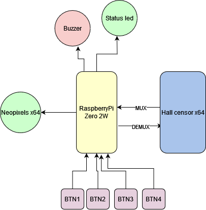

# Lechess
- An early prototyping for smart chess board.

**[Please refer to our planning](https://docs.google.com/spreadsheets/d/1tzjvebM3ZJ8TDiEOB72k3z0SsBjHDWrlPy9oBXgbvGs/edit?gid=1570832848#gid=1570832848)**

****

Figure 1: Hardware block diagram

****

Figure 2: System diagram

# LeChess Functionalities
**1. User Authentication**

    Login: Allows users to log in to the app using their credentials (e.g., email and password). The app sends a request to the NodeJS server, which authenticates the user and provides a JWT token.
    Register: Allows new users to create an account. The account data (username, email, password, etc.) is stored in the NodeJS server and MongoDB.
    Logout: Allows users to log out of the app, clearing their session data.
    Password Reset: Enables users to reset their password via email or SMS by sending a request to the NodeJS server.

**2. Online Mode (App-Only Mode)**

These functions are available when the user is online and connected to the NodeJS server:

*2.1. Play with Computer*

    Start New Game: Users can start a new game against a cloud-based chess engine (e.g., Stockfish).
    Make Move: Users can make a move, and the app sends the move to the NodeJS server to be processed by the chess engine.
    Receive Move: The app receives the move from the chess engine and updates the board.
    Offer Draw/Resign: Users can offer a draw or resign during gameplay.
    Game Over: Displays the result of the game once it's finished (win/loss/draw), and save pgn to database

*2.2. Play with Friend: 2 players*

    Record names of the two players.
    Real-Time Move Updates: The app sends and receives real-time moves from the NodeJS server during a multiplayer game.
    Game Over: Displays the result when the game is finished, and save pgn to database

*2.3. Puzzle Mode*

    Select Puzzle: Users can choose chess puzzles from the server (e.g., checkmate in 2, etc.).
    Solve Puzzle: The app displays the puzzle, and users try to solve it by making moves. The NodeJS server verifies whether the solution is correct.
    Hints: Users can request hints from the server if needed.

*2.4. PGN File Visualization*

    Choose PGN: choose a match from the matches the user played before.
    View PGN: The app reads the PGN file and displays the game on the chessboard for the user to review.
    Step Through Game: Users can move forward and backward.

**3. Bluetooth Mode (Using the Physical Chessboard)**

These functions are available when the user is connected to the physical chessboard via Bluetooth and the Flask server on the Raspberry Pi:

*3.1. Play with Computer* 

    Start New Game: Users can start a new game against a local Stockfish on Raspberry Pi.
    Make Move on Physical Board: The physical chessboard detects the user's move and sends the move to the app over Bluetooth.
    Receive bot Move: The Raspberry Pi processes the move via the chess engine and sends the bot's move back to the app and the physical board and give the pcb led data to light the move up.
    Recommend Move: Moves recommended by the bot will be prcessed to LED data to be lighten up on the board.
    Game Over: Displays the result of the game (win/loss/draw) once it’s finished, and save pgn to database.

*3.2. Play with Friend (Over the Board)*

    Start New Game: Users can start a new game against a friend on the physical chessboard.
    Real-Time Move Detection: The app updates the game state as moves are detected from the chessboard.
    Recommend Move: Moves recommended by the bot will be prcessed to LED data to be lighten up on the board.
    Game Over: Displays the result when the game is finished and saves the game locally on the app or syncs it to the cloud, and save pgn to database.

*3.3. PGN File Visualization*

    Choose PGN: choose a match from a matches list the user have played before using the phone.
    Raspberry Pi server processed PGN and output LED data.
    User can choose to go forward on their phone, or set an automatic mode to go to next move every certain amount of time.
    
